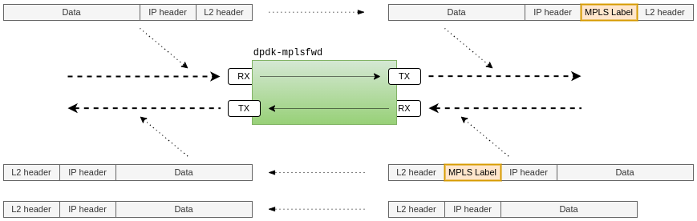

# DPDK-MPLS-Forwarder


## About The Project

Mpls-forwarder is a command line application (*dpdk-mplsfwd*) based on Data Plane Development Kit ([DPDK](http://core.dpdk.org/doc/)) that processes frames being passed between two interfaces.

The main task of the application is to add an MPLS label to each frame containing an IPV4 or IPv6 packet that is received on input (first) port and forward the modified frame to the output (second) port. In the case of communication in the opposite direction, if an incoming frame on the second port is tagged with an MPLS label, that label is removed and the frame is forwarded through the first (input) port.




## Getting Started

Mpls-forwarder was written with the Linux environment in mind and its compilation on FreeBSD or MS Windows may currently require some modification to the application code.

The ***dpdk-mplsfwd*** application requires [DPDK](http://core.dpdk.org/download/) to compile and run (*DPDK 22.11.1 LTS is currently tested and supported version*).

You can install and use the DPDK version available for your Linux distribution of choice. However, in certain circumstances, manual installation may be the preferable method. Detailed [instruction](https://doc.dpdk.org/guides/linux_gsg/build_dpdk.html) is available on the official DPDK website.

If DPDK is already installed and configured on your system, *dpdk-mplsfwd* can be built using ***meson*** and ***ninja*** tools:

```sh
$ git clone https://github.com/codilime/dpdk-mpls-forwarder.git
$ cd dpdk-mpls-forwarder
$ meson setup build
$ meson compile -C build/
```

If your meson version is older than 0.55.0 or somehow isn't backend-agnostic:

```sh
$ meson setup build
$ ninja -C build/
```


## Usage

### Hugepages setup

The first step is to configure **hugepages**. You can do it manually or install ***libhugetlbfs*** tools. However DPDK provides a handy script to do it in one line command:

If the DPDK installation is system-wide
```sh
$ sudo dpdk-hugepages.py -p 1G --setup 2G
```

Otherwise, you can find it in the DPDK sources directory

```sh
$ cd path/dpdk-<version>
$ sudo usertools/dpdk-hugepages.py -p 1G --setup 2G
```

To check the number of allocated huge pages the following command can be used.

```sh
$ sudo usertools/dpdk-hugepages.py -s
Node Pages Size Total
0    2     1Gb    2Gb
```


### Running the Application

The application has a number of command-line switches:

```sh
$ ./dpdk-mplsfwd [EAL options] -- [mplsfwd options]
```

Tool-specific options can be checked with the `dpdk-mplsfwd -- --help` command.

```shell
$ ./dpdk-mplsfwd -- --help
  --help | -h      : display this message and quit.
  --gabby          : print additional information at startup.
  --mpls-label=<N> : MPLS label value (default=16).
  --mpls-ttl=<N>   : TTL value (default=64, maximum=255).
  --mpls-on-dev=NAME
                   : explicit device name for which the MPLS header is added
                     for each incoming packet. Otherwise, the devices order
                     returned by DPDK is used and the first device is used.
 --core-list=<N,...,M|N-M|N-M,X>
                   : list of cores for packet stream processing.
                     When the list is not given, packet processing is started
                     on the main core only.
 --rxq=<N>         : configure N RX queues per core (default=1).
 --txq=<N>         : configure N TX queues per core (default=1)
```

The following examples shows how to run an application to forward packets between two ***memif*** (shared memory packet interface) interfaces:

```sh
$ sudo ./dpdk-mplsfwd --vdev=net_memif0,id=0,role=server --vdev=net_memif1,id=1,role=server -- --txq=4 --rxq=2 --mpls-ttl=10
```


Mpls-forwarder requires two ports by design to function properly and do its job and cannot be run in any other configuration. If your system uses several PCI devices and you only need one or two for mpls forwarding, the DPDK arguments could be handy.
The list of physical devices that the application tries to use can be specified using the DPDK [arguments](https://doc.dpdk.org/guides/linux_gsg/linux_eal_parameters.html): `-a, --allow <[domain:]bus:devid.func>` or `-b, --block <[domain:]bus:devid.func>`

```sh
$ sudo ./dpdk-mplsfwd -a 0000:31:00.0 ... -- ...
```


#### Order of ports

Mpls-forwarder uses ports enumerated and managed by DPDK. In the current version of DPDK, device probe order is set to physical PCIe devices first, and then virtual devices. It means that running mpls-forwarding with arguments:

```sh
$ sudo ./dpdk-mplsfwd -a 0000:31:00.0 --vdev=net_memif1,id=0,role=server,socket-abstract=no
```

DPDK will expose the device **0000:31:00.0** first, and the device **net_memif1** second to the application. Consequently, mpls-forwarder will use **0000:31:00.0** as input device and **net_memif1** as output device. Because the ports order may be of consequence, the command line switch `--mpls-on-dev=<device>` was added. If we need to change input device and packet processing direction, we will use command.:

```sh
$ sudo ./dpdk-mplsfwd -a 0000:31:00.0 --vdev=net_memif1,id=0,role=server,socket-abstract=no -- --mpls-on-dev=net_memif1
```

The `--mpls-on-dev=net_memif1` argument instructs *dpdk-mplsfwd* to use the specified **net_memif1** port as input port, and all packets arriving at that port are modified and MPLS label is added.


## License

This repository is licensed under the [BSD 4-Clause License](LICENSE).
